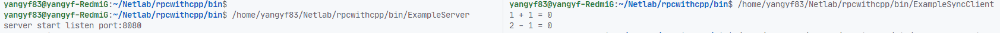

# RPC with CPP

<p align = "center"> 杨翼飞 20303068 </p>

## 项目简介

在课程“计算机网络” 中的大作业——尝试使用 C++ 和 protobuf 完成一个简单的玩具级的 RPC 实现。

## 主要的技术选型

1. 整体采用 http 协议作为传输的应用层协议
2. 使用 protobuf 作为序列化和反序列化的工具
3. 手撸了一份 C++ Linux Http 协议栈，支持同步，异步，并发调用

## 特性说明

1. 保留了超时控制的接口
2. 可以在用户端的服务发现和负载均衡
3. 客户端的同步和异步调用
4. 服务端使用IO多路复用进行网络IO

## 实现思路简述

### 消息的序列化和反序列化

项目使用谷歌 protobuf 进行序列化和反序列化，在 rpc 内核中，我们定义在对请求和回应进行动态代理之后的同一消息类型如下：

```protobuf
message RpcMessage
{
    MsgType type     = 1;     //消息类型
    int64 id         = 2;     //请求id
    uint32 serviceId = 3;     //服务ID
    uint32 methodId  = 4;     //方法ID

    bytes request    = 5;     //请求 protocol二进制编码
    bytes response   = 6;     //响应 protocol二进制编码
    ErrorCode error  = 7;     //错误码
}
```

其中有
```protobuf
enum MsgType
{
    REQUEST = 0;
    RESPONSE = 1;
    ERROR = 2; 
}

enum ErrorCode
{
    NO_ERROR = 0;               //正确响应
    WRONG_PROTO = 1;            //协议错误
    NO_SERVICE = 2;             //找不到服务
    NO_METHOD = 3;              //找不到方法
    INVALID_REQUEST = 4;        //错误请求
    INVALID_RESPONSE = 5;       //错误响应
    TIMEOUT = 6;                //请求超时
    PENDDING_LIMIT = 7;         //达到最大pending请求限制
}
```

分别表示消息的类型和错误码。详细的序列化和反序列化过程，我们在动态代理中进行说明。

### 服务注册

服务注册在 `net/RpcServer.cpp` 中实现。

在服务定义完成之后，我们对于服务名和每一个方法名都进行哈希计算，得到对应的id，定义一个哈希表来存储服务中的方法id和具体方法之间的关系。

### 动态代理

对于客户端，客户端在收到一个请求的时候，首先会对这个请求进行封装——收到的已经由 protobuf 封装之后的二进制请求信息作为对应的 `REQUEST`，生产出一个新的 `RpcMessage` 类型的代理消息序列化之后发送给客户端进行处理，在收到客户端对应的response之后，代理类又进行一次反序列化，拿到其中的 `RESPONSE` 传给调用者，这样在调用者不可感的情况下完成了客户端的动态代理。

对于服务端：当收到一个 protobuf 类型的请求的时候，Server首先得到其对应的服务和请求id和对应的 REQUEST 信息，找到对应的方法，反序列化 REQUEST 得到函数调用的参数，使用 `handleRpcCall()` 函数进行方法调用拿到对应的 response 消息之后作为对应 `RpcMessage` 消息的 `RESPONSE` 产生新的代理后的message序列化后进行网络传输，这样也就完成了服务端的动态代理。

### 客户端同步 异步 并发

得益于 protobuf 提供的框架，客户端同步和异步的实现相对来说比较容易。在`net/RpcClient.hpp` 中，我们定义了客户端调用类 `RpcChannel`，在类中我们重写了`google::protobuf::RpcChannel::CallMethod()` 函数，通过查阅 protobuf 文档我们直到函数的最后一个参数 `google::protobuf::Closure *done` 是指异步调用对应的回调函数指针，我们只需要判断 `done` 是否为空就能判断是否是异步调用，进行相应的操作即可。在异步调用结束之后运行对应的回调函数。

### 网络通信

网络通信部分使用 HTTP 协议进行，底层为TCP/IP协议。

由于C++原生的网络库基本上也只提供操作系统级别的抽象，这也决定了我的项目只能运行在 Linux 上，对其他平台无能为力。后面我会考虑换用folly, wangle等第三方库，网络部分可能会变得更普适一些。

### 负载均衡

我们使用一致性哈希算法来进行负载均衡的处理。服务器信息储存在跳表 SkipList 中。相关代码在文件夹 `util` 下。

### 服务发现 & 服务注册中心

在本项目中，这一部分内容是RPC框架提供抽象和底层调用支持，具体实现需要用户进行。在 `example/RegisterCenter.cpp` 中，我制作了一个最简单的抽象模板，可以提供最基础的服务注册功能。

## 运行

运行一个简单的同步调用demo，可以看到可以正常进行远程过程调用。



## 实验总结

在本次实验中，我使用 Protobuf 进行了一个简单的C++远程过程调用实现，作为一个脚手架完成了RPC所需要的各项基本功能，也给很多可以实现的功能比如超时控制，浏览器兼容等等留下了兼容和升级的空间。

在本学期的学习中，我也从无到有的对于计算机网络有了基础的了解和认识，对于计算机网络的原理、发展和应用都进行了不同程度的学习，在实践中也提升了自己的实践水平和应用能力，在本课程中收获良多。